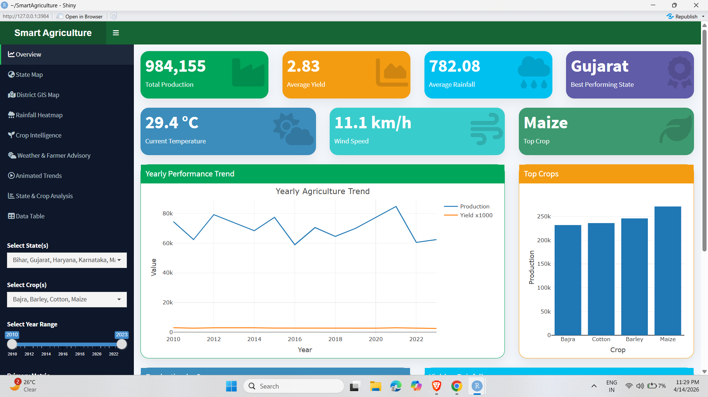
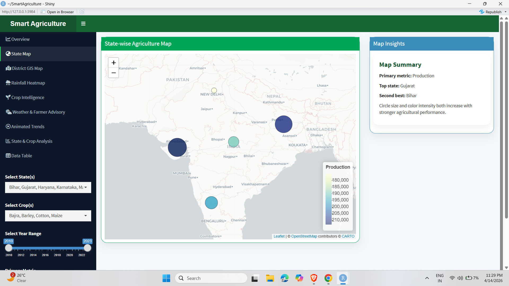
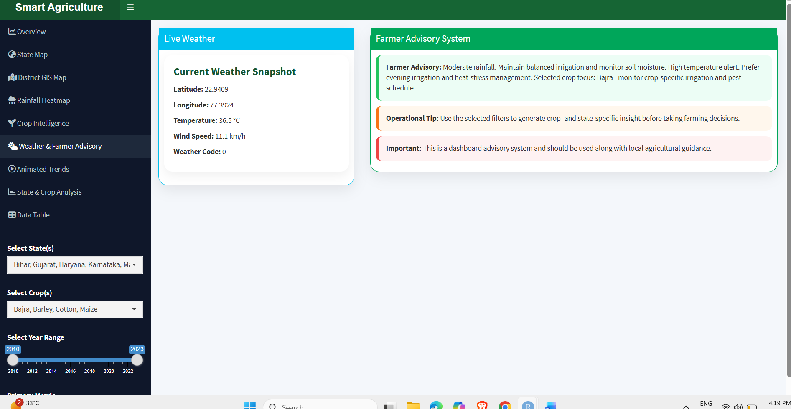
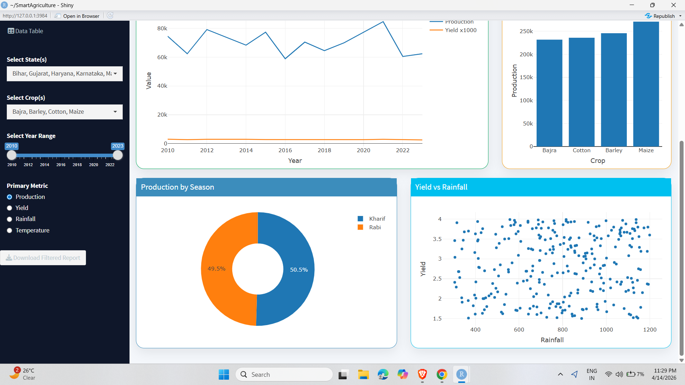
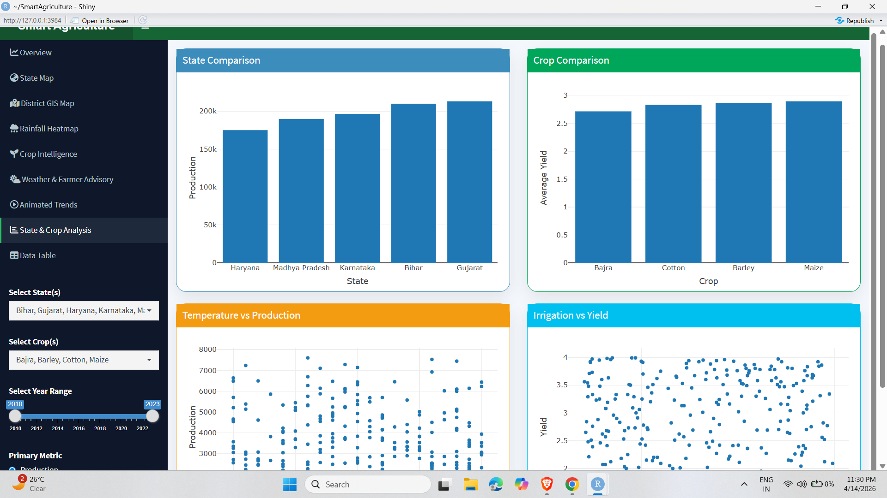

# 🌾 Smart Agriculture Pro Dashboard

## 📌 Overview

Smart Agriculture Pro Dashboard is an advanced data-driven web application built using R Shiny. It helps analyze agricultural data across India by providing insights into crop production, rainfall, yield patterns, and environmental factors.

This project combines **data analytics, GIS mapping, and real-time weather integration** to assist in smarter farming decisions.

---

## 🚀 Features

* 📊 Interactive dashboard with dynamic filters
* 🗺️ State-wise and District-wise GIS mapping
* 🌧️ Rainfall heatmap visualization
* 🌦️ Real-time weather data integration (API-based)
* 🌱 Rule-based crop recommendation system
* 📈 Animated crop production trends
* 📉 Comparative analysis (State & Crop)
* 📋 Interactive data table with filtering
* 📥 Downloadable reports (CSV format)

---

## 🧠 Key Highlights

* Integrated **Leaflet GIS maps** for geographical insights
* Built a **Farmer Advisory System** based on climate conditions
* Combined **historical data + real-time API**
* Fully interactive and responsive dashboard

---

## 🛠 Tech Stack

* **Language:** R
* **Framework:** Shiny, Shiny Dashboard
* **Libraries:**

  * plotly (interactive charts)
  * leaflet (maps)
  * dplyr, data.table (data processing)
  * DT (data tables)
  * httr, jsonlite (API integration)

---

## 🌐 Live Demo

👉 https://ritikgupta-dev.shinyapps.io/SmartAgriculture/

---

## 📸 Screenshots

### 🏠 Dashboard



### 🗺️ Map View



### 🌦️ Live Weather



### 🌱 Advisory System



### 📊 Crop Analysis



---

## 📂 Project Structure

```
Smart-Agriculture-Shiny/
│
├── app.R
├── data/
├── screenshots/
├── README.md
├── LICENSE
├── .gitignore
```

---

## ⚙️ How to Run Locally

1. Clone the repository:

```
git clone https://github.com/ritikgupta03/Smart-Agriculture-Shiny.git
```

2. Open in RStudio

3. Install required packages:

```
install.packages(c("shiny","shinydashboard","plotly","leaflet","dplyr","data.table","DT","httr","jsonlite"))
```

4. Run the app:

```
shiny::runApp()
```

---

## 🎯 Use Cases

* Agriculture data analysis
* Crop performance comparison
* Weather-based decision support
* Academic and research projects
* Farmer advisory insights

---

## 📌 Future Enhancements

* 🤖 Machine Learning-based crop prediction
* 🔐 User authentication system
* 📱 Mobile responsive UI
* 🌍 Real-time government agriculture APIs

---

## 👨‍💻 Author

**Ritik Gupta**

* GitHub: https://github.com/ritikgupta03

---

## 📜 License

This project is licensed under the MIT License.

---

⭐ If you like this project, consider giving it a star!
